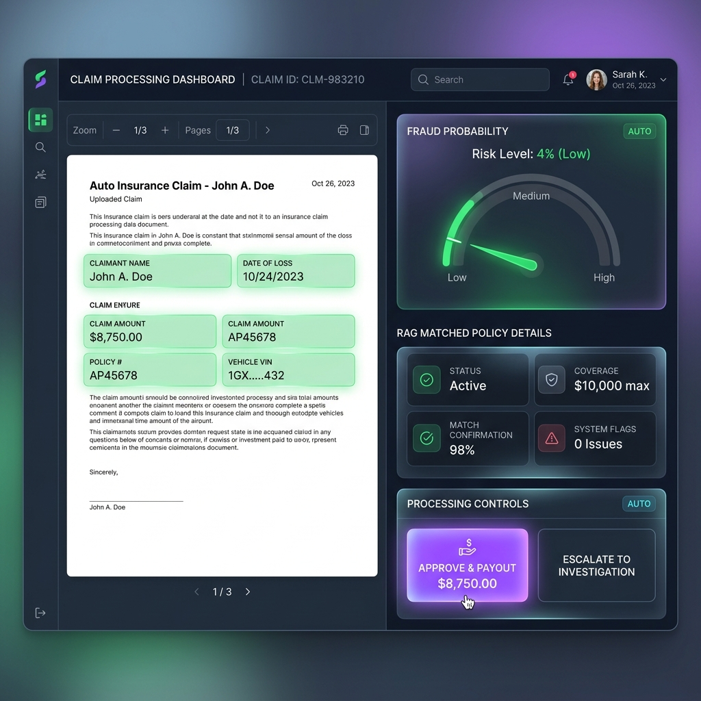
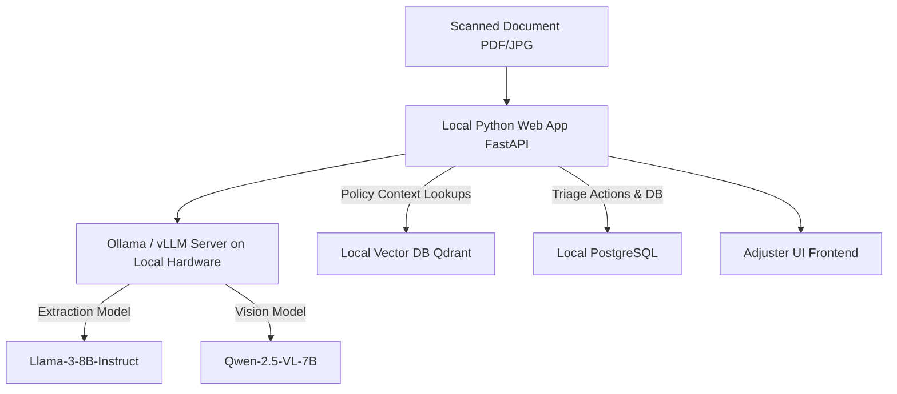

# Product Roadmap — Enterprise Insurance Adjuster Platform

This document outlines the strategic plan to transition our current Mock/AWS Bedrock proof-of-concept into a **production-ready, zero-licensing-cost enterprise application**.

---

## 1. Real-World Challenges & Mitigation

| Challenge | Impact | Production Mitigation |
|---|---|---|
| **Multi-page PDFs / Receipts** | Adjusters waste hours typing data from scanned bills and doctor notes. | Integrated **Llama-3.2-Vision** or **Qwen-2.5-VL** to extract structural key-value tables directly from images. |
| **Fraudulent Duplication** | Claimants submit identical doctor bills to multiple insurers. | **Metadata Hashing:** Calculate cryptographic hashes of bill structures and compare them against historical DB. |
| **Hallucination Risk** | AI recommending payments for excluded policy terms. | **RAG Hard-Grounding:** The UI displays the matching policy source alongside the summary. Adjusters must click a checkbox verifying the source matches. |

---

## 2. Hardest Engineering Problems

1. **Deterministic OCR at Scale:**
   * *Problem:* Converting complex layouts (like hospital bills with hundreds of line items) into JSON without dropping digits or mixing up rows.
   * *Solution:* A pipeline using **LayoutLMv3** to extract the layout structure first, then feeding bounding-box crops to specialized local OCR engines (like **EasyOCR** or **Tesseract**).

2. **Real-time Vector Store Sync:**
   * *Problem:* Policy booklets change frequently. Rebuilding the RAG index in memory every time a claim is processed is extremely inefficient.
   * *Solution:* Switch from basic list-based similarity to an active local vector database (like **Qdrant** or **ChromaDB**) which supports instant document insertion, update, and deletion.

---

## 3. The "Intelligent Move" — Zero-Cost Production Stack

To build a enterprise-grade dashboard with **zero base licensing/API fees**, we will replace proprietary APIs (AWS Bedrock / OpenAI) with high-performance **Open-Source Local Models**:

### The Free Open-Source Architecture:
* **Inference Engine:** **vLLM** or **Ollama** running locally on a corporate server equipped with a GPU (e.g., an NVIDIA RTX 4090 or a server-grade A10G).
* **Models:**
  * **Llama-3-8B-Instruct:** Extremely fast, matches Claude 3 Haiku accuracy for standard structured text extraction.
  * **Qwen-2.5-VL:** Outperforms proprietary models on table reading and complex layout PDF scans.
* **Vector Store:** **ChromaDB** or **Qdrant** (Open-source, self-hosted inside a Docker container).
* **Database:** **PostgreSQL** with **pgvector** to handle relational claim data and vector search inside a single database.
* **Hosting:** Served locally via **FastAPI** + **Docker Compose** on local hardware.

---

## 4. Premium Production UI Features

1. **Split-Screen Interactive Viewer:**
   * The left side displays the customer's PDF bill. As the user hovers over extracted items in the right-side form, the corresponding section on the PDF lights up in blue.
2. **Fraud Risk Meter:**
   * Highlights suspicious elements (e.g., matching claim amounts from other policies, or incidents occurring on the policy activation date).
3. **One-Click Action Bar:**
   * Glowing quick-action buttons: `Approve Payout`, `Reject (No Coverage)`, and `Escalate to Fraud Unit` directly connected to automated email notifications.
